# B551 Assignment 4: Machine learning 
                                  
                               
## Image classification

In this assignment we’ll study a straightforward image classification task. These days, all modern digital
cameras include a sensor that detects which way the camera is being held when a photo is taken. This metadata is then included in the image file, so that image organization programs know the correct orientation —
i.e., which way is “up” in the image. But for photos scanned in from film or from older digital cameras,
rotating images to be in the correct orientation must typically be done by hand.
Your task in this assignment is to create a classifier that decides the correct orientation of a given image, as
shown in Figure 1

## Data
To help you get started, we’ve prepared a dataset of images from the Flickr photo sharing website.
The images were taken and uploaded by real users from across the world, making this a challenging task
on a very realistic dataset.1 Since image processing is beyond the scope of this class, we don’t expect you
to implement any special techniques related to images in particular. Instead, we’ll simply treat the raw
images as numerical feature vectors, on which we can then apply standard machine learning techniques. In
particular, we’ll take an n × m × 3 color image (the third dimension is because color images are stored as
three separate planes – red, green, and blue), and append all of the rows together to produce a single vector
of size 1 × 3mn.
We’ve done this work for you already, so that you can treat the images simply as vectors and do not have
to worry about them being images at all. Thorugh Canvas we’ve provided two ASCII text files, one for the
training dataset and one for testing, that contain the feature vectors. To generate this file, we rescaled each
image to a very tiny “micro-thumbnail” of 8 × 8 pixels, resulting in an 8 × 8 × 3 = 192 dimensional feature
vector. The text files have one row per image, where each row is formatted like:
photo_id correct_orientation r11 g11 b11 r12 g12 b12 ...
where:
  •   photo id is a photo ID for the image.
  •   correct orientation is 0, 90, 180, or 270. Note that some small percentage of these labels may be
      wrong because of noise; this is just a fact of life when dealing with data from real-world sources.
  •   r11 refers to the red pixel value at row 1 column 1, r12 refers to red pixel at row 1 column 2, etc.,
      each in the range 0-255.
The training dataset consists of about 10,000 images, while the test set contains about 1,000. For the training
set, we’ve rotated each image 4 times to give four times as much training data, so there are about 40,000
lines in the train.txt file (the training images on Flickr and the ZIP file are all oriented correctly already). In
test.txt, each image occurs just once (rotated to a random orientation) so there are only about 1,000 lines.
If you view these images on Flickr, they’ll be oriented correctly, but those in the ZIP file may not be.

```
./orient.py train train_file.txt model_file.txt [model]
./orient.py test test_file.txt model_file.txt [model]

where [model] is again one of nearest, tree, nnet, best
```

This program should load in the trained parameters from model file.txt, run each test example through the model, display the classification accuracy (in terms of percentage of correctly-classified images), and output a file called output.txt which indicates the estimated label for each image in the test file. The output file should correspond to one test image per line,
with the photo id, a space, and then the estimated label, e.g.:

```
test/124567.jpg 180
test/8234732.jpg 0
```
## Solution

#### K-Nearest Neighbour

```
Implementation:
  1. Load the data
  2. Calculate the distance between test data and each row of training data. Here we are using Euclidean distance as our            distance metric
  3. Take the most frequent class for the K-Nearest neighbours.
  
```

### Distances used
  ```
  1. Euclidean distance
  2. Manhattan distance
  3. Minkowski distance 
  ```
  
### K vs Accuracy
<br/>
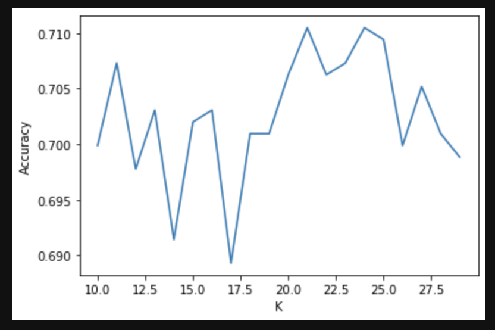
<br/>

### Accuracy vs Sub Sample Size for KNN
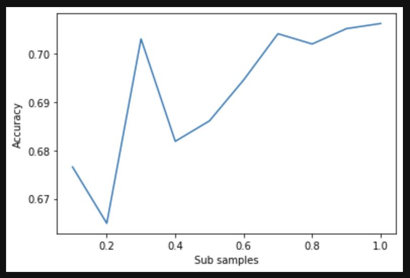
<br/>

### Run time VS Sum Samples used
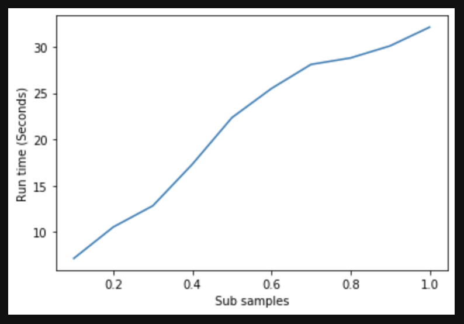
<br/>

Based on the above graphs, best accuracy was obtained at K = 21 with 5 fold cross validation and as the sub sample size increased, accuracy improved with it. 

#### Decision Trees
  
```
Implementation for training data:
      1. Start with the root node.
      2. Calculate entropy for all columns present in the root node.
      3. Choose the column with minimum entropy
      3. For the column with minimum entropy, find the entropy of values present in the column to set the decision node.
      4. Split data into groups
      5. Move the data along the respective branches.
      6. Repeat the process until a stopping criterion is met which is max depth reached.


  Implementation for testing data:
      1. Start with the root node
      2. Extract the split value and split column at the root node.
      3. Move through the decision tree branches using split value and column
      4. Repeat the process until the leaf node is reached.
      5. Once leaf node is reached, extract the class label associated with the leaf node for the given test data.
    
```
     
 


### Entropy formula:

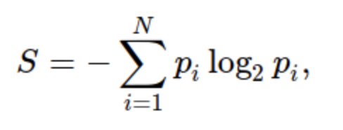

### Run time vs Sub Sample Size taken
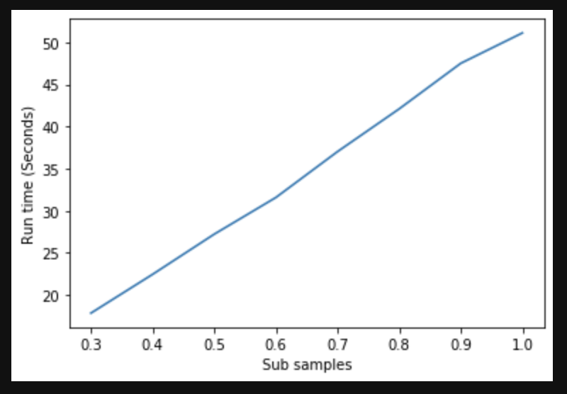
<br/>

### Depth vs Accuracy
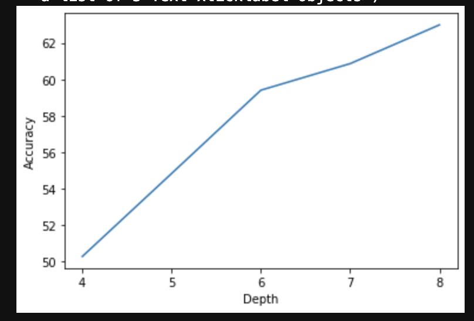
<br/>

### Accuracy vs Sub Sample size taken
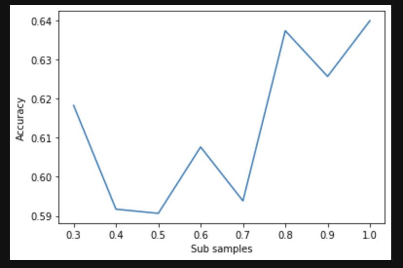
<br/>

From the above graphs, we can conclude that best accuracy was obtained at depth = 8 and acuuracy is higher when the sub sample size is greater than 0.7

### Neural Net

#### Algorithm

##### Forward Propogation

<br/>

<br/>

##### Backward Propogation

<br/>


<br/>
#### Activation functions tried

```
1. Sigmoid
2. ReLu
3. Tanh
```
##### Parameters tuned (Hyper Parameters)

```
1. Number of Layers
2. NUmber of hidden units in each layer
3. Activation function in each layer
4. Learning rate
```

Final architecture which gave us the best result [Input Layer, 128, 128, 4] with Relu activation function and cross entropy loss

### Accuracy vs Sub samples size taken
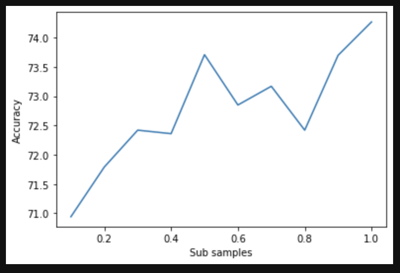
<br/>

### Time vs Sub samples
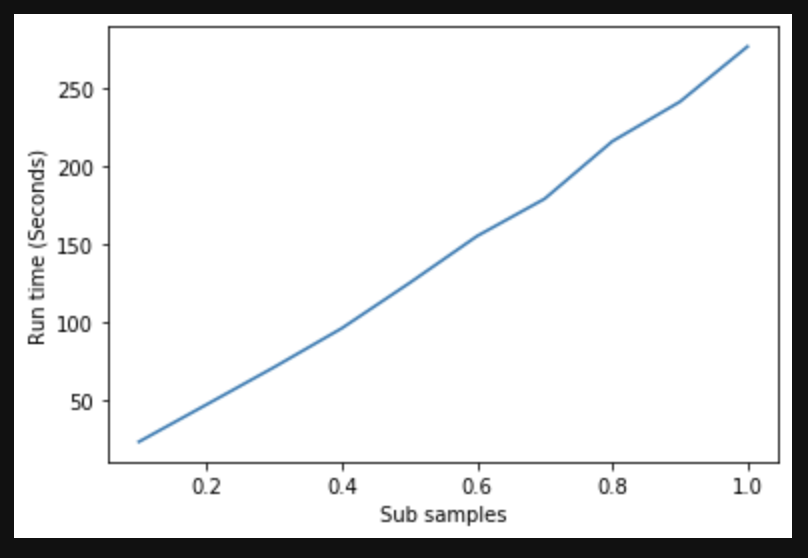
<br/>

### Examples of Correctly classified images

<br/>

#### Image Name: 10008707066.jpg
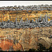

#### Image Name: 10099910984.jpg


#### Image name: 10107730656.jpg
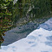
<br/>

### Examples of Incorrectly classified images

<br/>

#### Image Name: 10196604813.jpg
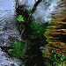

#### Image name:10352491496.jpg
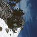
<br/>

#### Image name: 10484444553.jpg
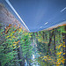
<br/>

### Final Accuracies obtained

```
1. KNN : 71%
2. Decision Trees : 63%
3. Neural Network : 74%
```

The best accuracy obtained is from Neural network. Also KNN has similar range of accuracy but it is sensitive to outlier data, hence we recommend using Neural Networks with the above mentioned architecture. When we look at the misclassified images the distribution is similar across classes. Hence no patterns in the error was found.

### References

```
1. https://medium.com/@rakendd/building-decision-trees-and-its-math-711862eea1c0
2. https://medium.com/@rakendd/decision-tree-from-scratch-9e23bcfb4928
3. https://stackabuse.com/creating-a-neural-network-from-scratch-in-python/
4. Deeplearning.ai Deep Neural network L layer architecture
5. https://medium.com/analytics-vidhya/mnist-digits-classification-with-deep-learning-using-python-and-numpy-4b33f0e1da
6. https://towardsdatascience.com/how-to-build-your-own-neural-network-from-scratch-in-python-68998a08e4f6
```
